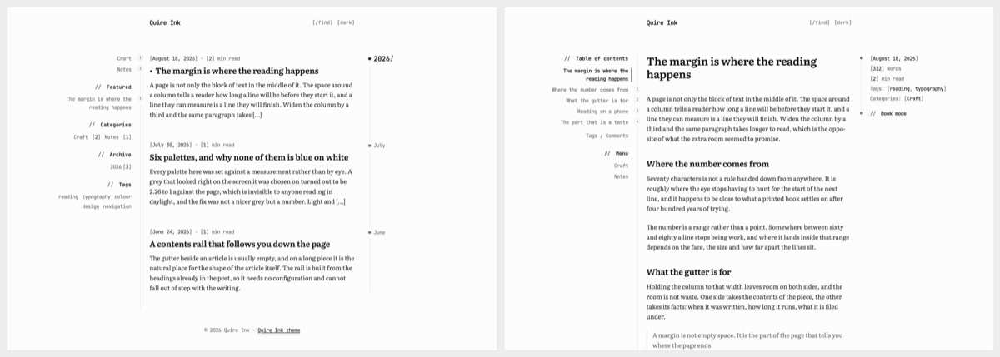
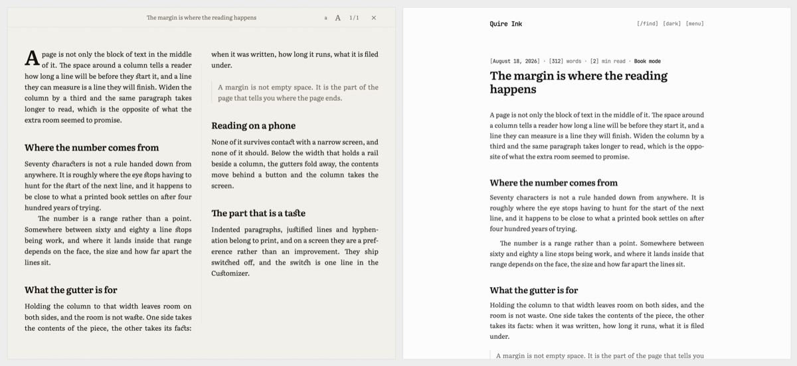
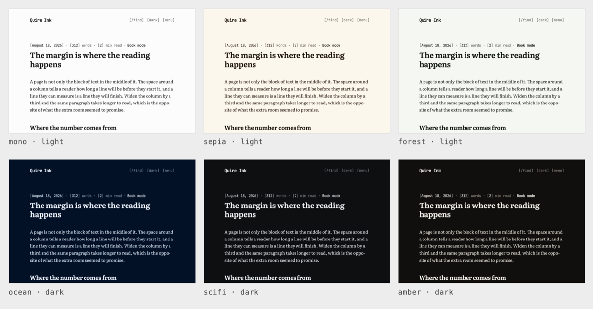
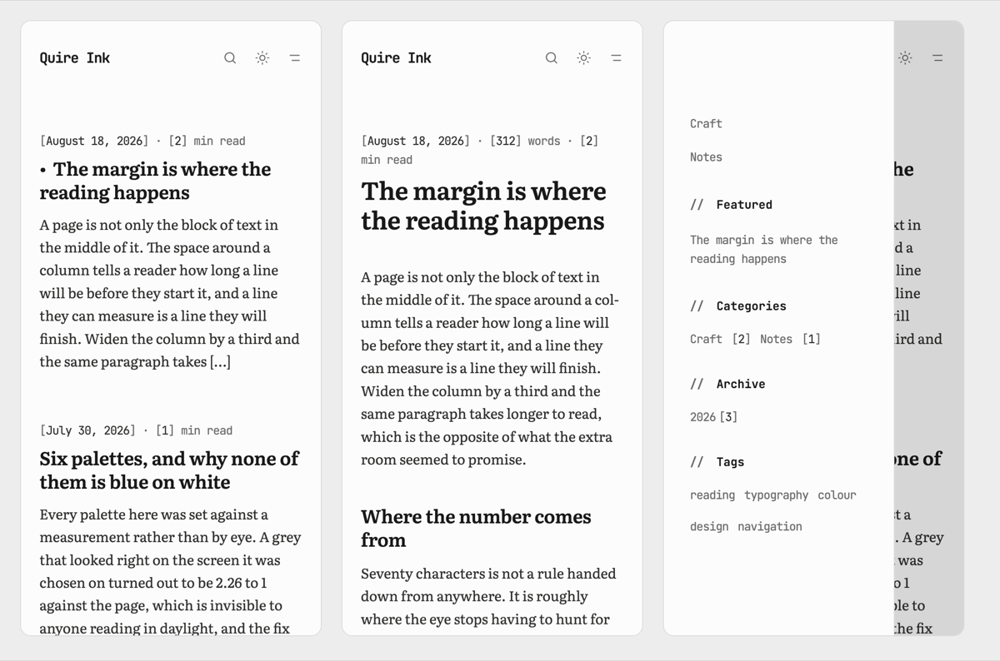

<div align="center">

# Quire Ink for WordPress

`0.1.0`

**A WordPress theme for people who write long things and want them read.**
The reading surface of the [Quire Ink](https://quireink.com) blog engine, generated from that
engine's own stylesheet rather than copied by hand.
No Google Fonts, no CDN, no analytics, no request off your own domain.


[**Quire Ink**](https://quireink.com) ·
[**the engine**](https://github.com/joiha-steven/quireink) ·
[**demo.quireink.com**](https://demo.quireink.com) ·
[**directory ticket**](https://themes.trac.wordpress.org/ticket/288845) ·
[**what it costs**](#what-it-costs-a-reader) ·
[**why not something else**](#why-not-something-else) ·
[**install**](#install)



<sub>The listing and an article, at the width that holds three columns. The middle one is about seventy characters wide and the two gutters are what is left, which is the design rather than a detail of it. Below that width the gutters fold away on their own and the column takes the screen.</sub>

</div>

## What it is

A theme for a blog whose point is the writing.

A reader opens a post and gets one column in a book face, the article's own contents standing
in the gutter beside it, and its facts in the gutter on the other side. They can pick one of
six palettes in light or dark and the site remembers it. Nothing on the page is fetched from
anyone else: the six typefaces are in the theme, there is no analytics, no avatar service and
no font host, so a stranger on a weak signal is waiting for your words and nothing else.

Everything visual is **generated** from the Quire Ink blog engine's own stylesheet, the same
sheet that blog renders with. Not an impression of it, and not a copy that drifts: the
extractor runs the engine's emitters and a static check compares bytes.

It is a **classic theme**. Settings live in the Customizer, there is no Site Editor, and
nothing of yours is locked in: no custom post type, no taxonomy, no database table, no
shortcode. Switch away and every post is still a post.

## What you get

| The part | What it does |
|:---|:---|
| 📐&nbsp;**The&nbsp;page** | One column of about seventy characters, the contents of the post in one gutter and its facts in the other. Below the width that holds them, both fold away without a second layout to maintain |
| 🎨&nbsp;**Colour** | Six palettes, each in light and dark, chosen by the reader and remembered on their device. Every one clears WCAG AA against its own background, and a static check re-measures all sixty colours on every run |
| 🔤&nbsp;**Type** | Six typefaces in the theme, all OFL, cut to Latin, Latin Extended and Vietnamese. Twenty-one files ship and a browser fetches four, because each face declares the characters it covers |
| 📖&nbsp;**Book&nbsp;mode** | The article reset in two columns with a drop cap, sized from the window, with the reader's place kept |
| ✒️&nbsp;**Book&nbsp;typography** | Indented paragraphs, justified lines, hyphenation at the break. Off by default, because it is a taste and not an improvement |
| 🗓️&nbsp;**The&nbsp;listing** | A spine down the gutter with a sticky year and a marker at each new month, positioned against cards that are already there. Nothing measures anything |
| 🧱&nbsp;**Writing** | The block editor shows the article: same face, same column width, same code styling. Eight patterns in their own category and four styles on the image block, each reaching something the sheet already draws |
| 🧭&nbsp;**The&nbsp;rail** | Left alone it is the site's own structure: menu, sticky posts as Featured, categories, archive, tags. Put a widget in it and the widgets are the rail. Both are the rail |
| 🖼️&nbsp;**Pictures** | Featured images in two shapes, off by default, and a frame around every figure on the site in three weights plus an ink variant |
| 🌍&nbsp;**Languages** | Translation-ready, 160 strings, no translations shipped. An RTL locale gets a mirrored stylesheet WordPress links by itself |
| 🖨️&nbsp;**Print** | Prints the article and leaves the furniture out |
| 🔒&nbsp;**Privacy** | Zero third-party requests. No fonts, no scripts, no analytics, no avatars, no update check of its own |

**Made for** one person writing long pieces on their own WordPress.
**Not made for** a magazine front page, a shop, or a site whose design is its photographs.

<div align="center">



<sub>Book mode and book typography, which are not the same thing and neither is a filter over the page. Book mode reflows the article into columns sized from the window. Book typography changes how the type is set, and it ships off: justification and hyphenation belong to print, and on a screen they are a preference. Both are the reading typography itself, which is why the specimen above is set in Literata with its Vietnamese accents rather than falling back to whatever the system has.</sub>



<sub>Six palettes, each carrying light and dark, so a palette that only works in one scheme is not shipped. Every colour comes from the blog engine and none is written into this theme, which is also why they can be checked rather than trusted: <code>check:contrast</code> reads all sixty out of the generated file and measures each against its own background on every run. The tightest is 5.01:1 where WCAG AA asks 4.5:1.</sub>



<sub>Below the width that holds a rail beside a column, the gutters fold away and the rail becomes a drawer. There is no second layout: it is the same stylesheet and the same markup, and the breakpoint is computed from the reading column rather than typed in.</sub>

</div>

## What it costs a reader

One long article on the local stack, gzipped as served, no plugins. The post's own pictures
are not counted, because those are your content and not the theme.

| | Over the wire | |
|:---|---:|:---|
| **First visit** | **≈ 152 KB** | 146 KB with the source-code furniture switched off |
| **Every visit after** | **≈ 18 KB** | only the HTML is fetched again |
| Fonts | 68.2 KB | **4 of the 21 faces that ship**; a browser takes only the character ranges the page uses |
| CSS | 46.9 KB | 39.0 of it the generated sheet, +6.5 only when the source-code furniture is on |
| JavaScript | 12.0 KB | the engine's own reader bundles, plus WordPress's 1.4 KB reply script |
| HTML | 18.3 KB | 63.9 KB before gzip |
| **Third-party requests** | **0** | no CDN, no font host, no tracker, no avatar service |

The blog engine serves about 114 KB for the same shape of article, so the theme costs about a
third more, and the difference is WordPress's markup rather than the sheet.

## Why not something else

**Instead of a block theme.** There is no Site Editor here and that is a real trade: no style
variations, no template editing in the browser. What you get for it is a stylesheet that is
generated from a running blog rather than assembled out of `theme.json`, and settings that
name what they do.

**Instead of a theme with a thousand options.** Six panels. Density, corners and heading
weight are what make two Quire Ink sites look unlike each other, and they are three controls
rather than thirty.

**Instead of a theme that loads a font service.** The faces are in the theme. Nothing on the
page reaches another host, so there is nothing to disclose, nothing to block and nothing that
stops working when somebody else's CDN does.

**Instead of writing your own.** The boring half is done and pinned by nine static checks:
escaping, prefixes, stylesheet order, colour contrast, class names that reach a rule, the two
header blocks agreeing, and the generated CSS still matching the engine it came from.

## Install

From the WordPress admin, Appearance → Themes → Add New → Upload Theme, then Activate. Or:

```bash
git archive --format=zip --prefix=quire-ink/ -o quire-ink.zip HEAD:quire-ink
```

No build step, no compilation, no bundler: the repository is laid out the way the directory
wants it. Then Appearance → Customize for the palette and the shape, and Appearance → Menus
to put a menu in the **Rail menu** location, which is the sidebar, or in **Footer menu** for
a flat row of links above the credit.

## The idea

Nothing in `quire-ink/assets/css` is written by hand. [`tools/extract.ts`](tools/extract.ts)
imports Quire Ink's own stylesheet emitters from a sibling checkout and runs them, so every
colour, size and rule is the value the live blog renders with — and when the blog's front end
moves, the theme is re-generated rather than re-read. `check:generated` compares bytes so
drift is a red check instead of a slow surprise.

Quire Ink itself is **read only** from here.

```
quire-ink/      the theme (slug and text domain: quire-ink)
  assets/css/   2 generated + bridge.css, the one written by hand
  assets/js/    Quire Ink's own reader bundles, copied
  assets/fonts/ 21 self-hosted woff2, all OFL
  inc/          customizer, template tags, the reader JS's strings
tools/          extract.ts, shot.sh, and nine static guards under checks/
dev/            local WordPress in Docker, and a seeder that pulls real articles
docs/           invariants, conventions, decisions, and what does not carry over
```

## Verify

```bash
bun run check:all
```

## Regenerate the look

Needs a Quire Ink checkout at `../quireink`, and `bun`.

```bash
bun tools/extract.ts
```

## Look at it

Needs Docker.

```bash
dev/up.sh         # WordPress on http://localhost:8099, admin / admin
dev/seed.sh       # pull the articles in dev/seed/posts.txt off the live blog
dev/screenshot.sh # rebuild screenshot.png and docs/shots/, then put your database back
dev/down.sh       # stop, and throw the database away
```

`dev/up.sh` is idempotent: run it again after editing the theme and it re-syncs without
reinstalling. The theme is bind-mounted, so an edit is live on the next request.

## Compare against the real thing

```bash
tools/shot.sh https://manhhung.me/<slug> .tmp/shots/quireink.png
tools/shot.sh http://localhost:8099/<slug>/ .tmp/shots/wordpress.png
```

Turn on **Appearance → Customize → Quire Ink — reading → Book typography** first if the blog
being compared against has it on. It is off by default, as it is in Quire Ink.

## Documentation

[`docs/README.md`](docs/README.md) is the index. Start at
[`docs/invariants.md`](docs/invariants.md).
