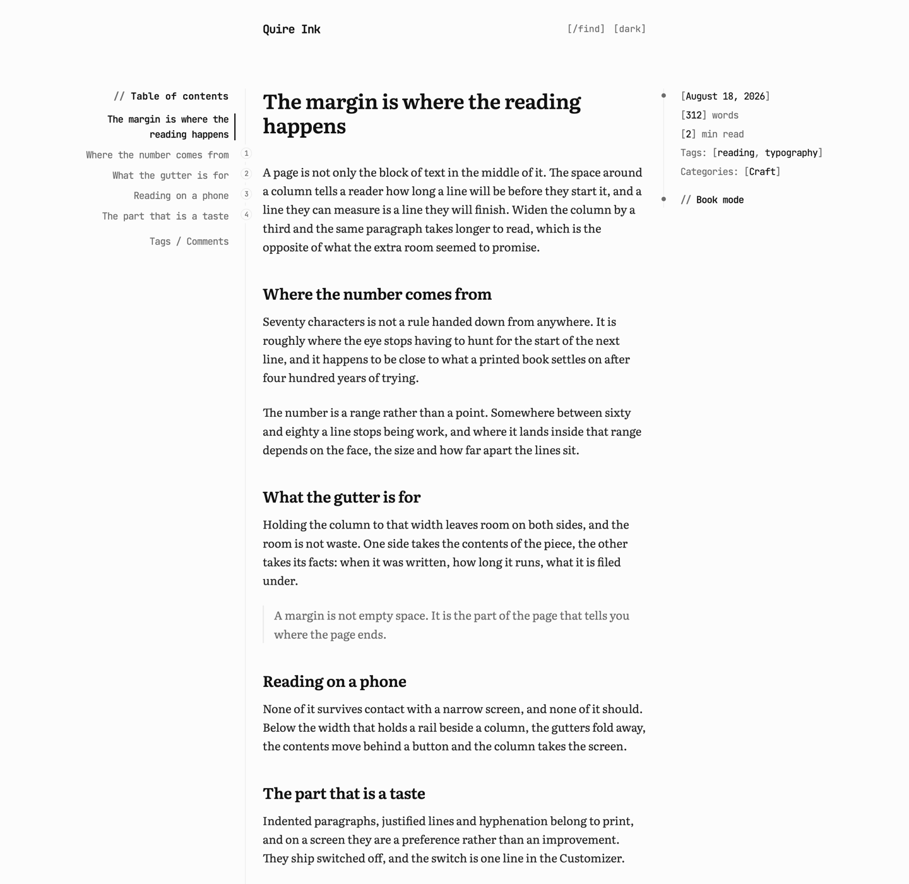
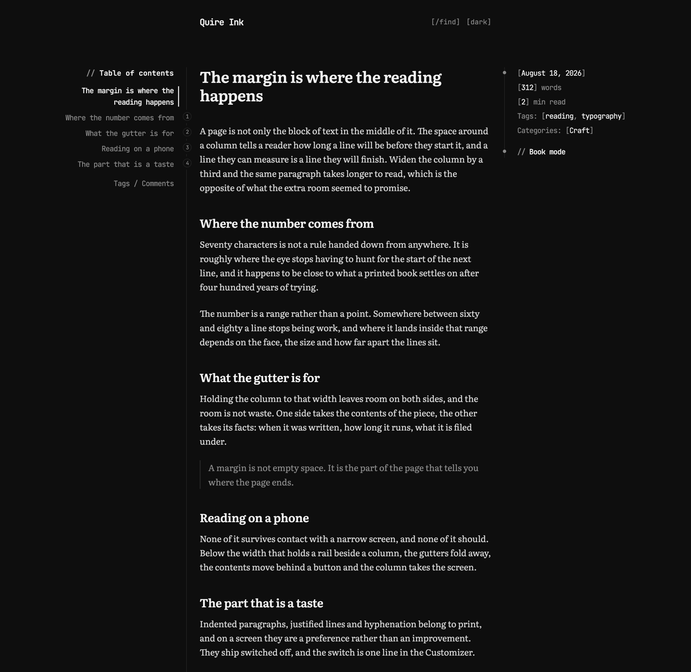
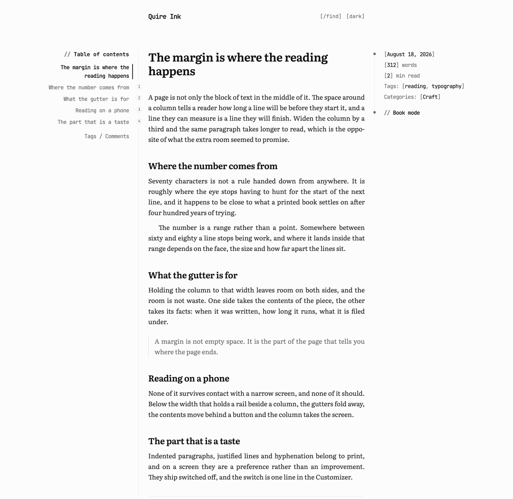
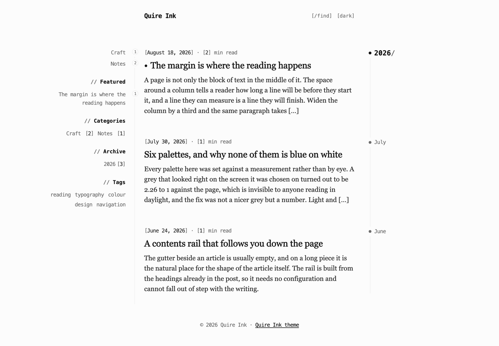

# Quire Ink for WordPress

The reading surface of [Quire Ink](https://quireink.com) as a WordPress theme: the same six
palettes, the same self-hosted type system, the same table-of-contents rail, book typography
and book mode, driven from WordPress content instead of Quire Ink's own.

**GNU GPL v2 or later** ([ADR 0005](docs/decisions/0005-gpl-v2-or-later.md)), which is what
WordPress requires of a free theme. Submitted to the directory as
[ticket #288845](https://themes.trac.wordpress.org/ticket/288845), where their Theme Check
reports the same 0 REQUIRED / 0 WARNING / 3 RECOMMENDED that `dev/check-theme.sh` reports here.

Quire Ink itself: [quireink.com](https://quireink.com) ·
[github.com/joiha-steven/quireink](https://github.com/joiha-steven/quireink) ·
[demo.quireink.com](https://demo.quireink.com)

## What it looks like

An article. The contents of the piece stand in the left gutter and track the scroll; its facts
stand in the right one. The column between them is about seventy characters wide, and that
width is the whole design rather than a detail of it.



The same page in dark. Six palettes ship, each carrying both schemes, and the reader picks once.



Book typography, which is off by default: paragraphs indented rather than spaced, lines
justified, words hyphenated at the break. It is a taste and not an improvement, so it is a
switch.



The listing, with the discovery rail on the left and a timeline down the right marking each
year and month.



Every picture above is built by [`dev/screenshot.sh`](dev/screenshot.sh) from a WordPress
seeded for the purpose, so they can be rebuilt rather than re-staged. Nothing under `docs/`
ships in the theme.

## The idea

Nothing in `quire-ink/assets/css` is written by hand. [`tools/extract.ts`](tools/extract.ts)
imports Quire Ink's own stylesheet emitters from a sibling checkout and runs them, so every
colour, size and rule is the value the live blog renders with — and when the blog's front end
moves, the theme is re-generated rather than re-read. `check:generated` compares bytes so
drift is a red check instead of a slow surprise.

Quire Ink itself is **read only** from here.

```
quire-ink/      the theme (slug and text domain: quire-ink)
  assets/css/   2 generated + bridge.css, the one written by hand
  assets/js/    Quire Ink's own reader bundles, copied
  assets/fonts/ 21 self-hosted woff2, all OFL
  inc/          customizer, template tags, the reader JS's strings
tools/          extract.ts, shot.sh, and nine static guards under checks/
dev/            local WordPress in Docker, and a seeder that pulls real articles
docs/           invariants, conventions, decisions, and what does not carry over
```

## Verify

```bash
bun run check:all
```

## Regenerate the look

Needs a Quire Ink checkout at `../quireink`, and `bun`.

```bash
bun tools/extract.ts
```

## Look at it

Needs Docker.

```bash
dev/up.sh         # WordPress on http://localhost:8099, admin / admin
dev/seed.sh       # pull the articles in dev/seed/posts.txt off the live blog
dev/screenshot.sh # rebuild screenshot.png and docs/shots/, then put your database back
dev/down.sh       # stop, and throw the database away
```

`dev/up.sh` is idempotent: run it again after editing the theme and it re-syncs without
reinstalling. The theme is bind-mounted, so an edit is live on the next request.

## Compare against the real thing

```bash
tools/shot.sh https://manhhung.me/<slug> .tmp/shots/quireink.png
tools/shot.sh http://127.0.0.1:8099/<slug>/ .tmp/shots/wordpress.png
```

Turn on **Appearance → Customize → Quire Ink — reading → Book typography** first if the blog
being compared against has it on. It is off by default, as it is in Quire Ink.

## Documentation

[`docs/README.md`](docs/README.md) is the index. Start at
[`docs/invariants.md`](docs/invariants.md).
